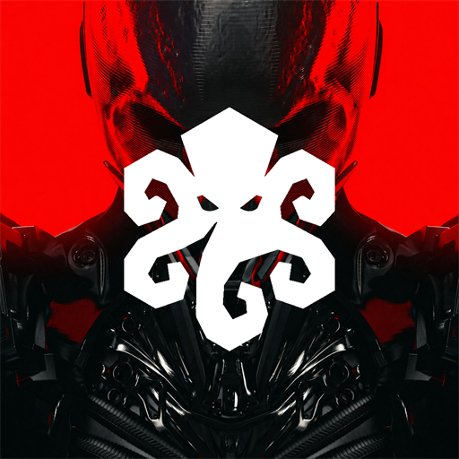

<div align="center">



# tartarusai-cli

_Uncensored AI coding agent. Doesn't refuse your own work._

[](https://github.com/Tartarus-AI/tartarusai-cli/releases/latest)
[](./LICENSE)
[](https://tartarusai.dev)

</div>

<br>

> _"I can't help with that."_ — every other coding agent, on routine work.
>
> Tartarus Coder ships the code.

<br>

**tartarusai-cli** is the official terminal client for **TartarusAI** —
an **uncensored AI** coding agent built for the work mainstream models
punt on. Security research, edge-case automation, the gnarly stuff.
No policy filter, no card on file, no _"as an AI…"._

<br>

## Install

Download a binary from the [latest release](https://github.com/Tartarus-AI/tartarusai-cli/releases/latest):

```bash
# Linux x86_64
curl -L -o tartarusai-cli https://github.com/Tartarus-AI/tartarusai-cli/releases/latest/download/tartarusai-cli-linux-x64
chmod +x tartarusai-cli && sudo mv tartarusai-cli /usr/local/bin/

# Windows x86_64 (PowerShell)
iwr https://github.com/Tartarus-AI/tartarusai-cli/releases/latest/download/tartarusai-cli-windows-x64.exe -OutFile tartarusai-cli.exe
```

macOS and ARM builds — email `team@tartarusai.dev`.

## Quickstart

1. Create an account and generate a CLI token at [`dash.tartarusai.dev/account`](https://dash.tartarusai.dev/account)
2. Save it to `~/.tartarus/cli-token.json` (Windows: `%USERPROFILE%\.tartarus\cli-token.json`):
   ```json
   {
     "endpoint":   "https://api.tartarusai.dev",
     "token":      "<paste-here>",
     "user_email": "you@example.com"
   }
   ```
3. Run `tartarusai-cli`

## Why

Every senior dev has the same story — *port scanner for my own lab,
deobfuscate this script from incident response, credential-rotation
tool that revokes leaked tokens.* Refused. Refused. Refused.

The models can do the work. They're trained to refuse, "for safety."
That refusal isn't safety — it's liability theater that shifts risk
onto you. So we built one that does the work.

## Features

- **Uncensored AI** — no policy filter between you and your editor
- **256K** context — whole repos in one prompt
- **Crypto-only billing** — no card on file, no recurring charge
- **~30s to live** — pay, network confirms, CLI activates
- **14-day refund** — earns its keep or you get it back

## Community

[Site](https://tartarusai.dev) · [Discord](https://discord.gg/GfzePawBBd) · [X / @TartarusAIDev](https://x.com/TartarusAIDev) · [Reddit / r/TartarusAI](https://reddit.com/r/TartarusAI) · [Blog](https://tartarusai.dev/blog) · `team@tartarusai.dev`

<br>

<details>
<summary><b>What this is <i>not</i></b> (read once)</summary>

<br>

- **Not a malware factory.** No weaponized payloads, no stealers, no spyware,
  no actual exploit kits. Writing lab PoCs for _patched, public_ CVEs is
  standard pentest material — we do that. Attacking systems you don't own —
  we don't help.
- **Not a piracy tool.** No DRM bypass, no keygens for someone else's
  software, no license cracking.
- **Not a politics bot.** It's a coding agent. We ship code.

The line is what every professional pentest course and CTF runs on.
The difference is we just _do the work_ instead of writing you an essay.

</details>

<br>

---

<sub>MIT-licensed. See [`LICENSE`](./LICENSE) and [`NOTICE`](./NOTICE) for full attribution.</sub>
